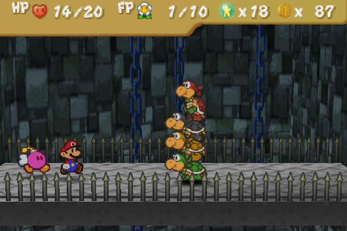

  
I am https://www.linkedin.com/in/xavier-trillo-lucero-9b19851a4/ (Xavier Trillo), student of the (Bachelor’s Degree in Video Games by UPC at CITM). This content is generated for the second year’s subject Project 2, under supervision of lecturer https://www.linkedin.com/in/mgarrigo/ (Marc Garrigó).

# Introduction: 
Video game bosses are one of the oldest and most recurring traditions in the video game industry. Through the years, they have been the source of important memories that a lot of people come back to when remembering their favourite videogames, specially, what they liked about them. Because of this, the design of a boss in a videogame can be one of the main influences that shape the opinion of someone about the game as a hole and, as such, they deserved to be treated with a very special care.

However, the task of creating good video game bosses that are also fresh and interesting isn’t as easy as it sounds and, through the years, they have proved to be one of the most challenging parts. Even so, there have been games that have managed to pull it off with remarkable success such as Dark Souls’s Ornstein and Smough, The Legend of Zelda: Ocarina of Time’s Ganon or Portal’s GladOS. And their success is thanks to their design.

On this website, I will to analyse the following aspects about video games bosses and their design in order to conclude what makes a good videogame boss design:

*	What is a video game boss and what they mean to the player.
*	How they affect the overall level/game design.
*	How to make a good boss design.
*	Example of good and bad boss designs.

# Video game boss definition and meaning to the player: 
“I try to remember these two points at all times while designing a boss battle: a boss is a test and a boss is a story". [https://www.gamasutra.com/view/feature/134503/boss_battle_design_and_structure.php?print=1](https://www.gamasutra.com/view/feature/134503/boss_battle_design_and_structure.php?print=1) (Mike Stout – Boss Battle Design and Structure).

A videogame boss can be described as an entity whose duty relies on testing the mastery of the player on the skills that they have learned through the game, in order to make sure that they have gained the knowledge and that they are able to keep evolving to face what it is ahead of him. In order to make sure that the player is well tested, they need to be difficult enough so they need to put their skills to prove and feel engaged while doing it, but not too difficult so the situation doesn’t feel unfair or overwhelming to the player.

Not only that, but it is also important that the player feels strong emotions when a boss battle starts, develops and concludes (intensity when they appear as well as when facing him, satisfaction and reward when defeated, etc) so the player is always looking forward to engage against them. This last part is where is important to make the boss feel like something else than an obstacle that the player needs to surpass: is where is important to make the boss feel like a story. Their defeat should feel like a goal that the player starts to proceed way before the battle, a goal that develops further as the the confrontation approaches and proceeds and that it is reached at the end of the fight in order to attain certain story based and emotional milestones meaningful to the player. 

# How they affect the overall level/game design.
As said before, bosses should feel like a test to the skills of player that has acquired thought the level or thought the game (depends on the type of boss). Because of this, the level or game design that revolves around a video game boss should act like a large scale tutorial to the inevitable battle that will occur, with a theme similar to the boss (similar assets, ideas, etc) in order to have a sense of cohesion though the level or game.  
However both the levels in the game, as well as the game need to keep minimum standards of their own. This means that they don’t need to simulate any part of the boss and instead develop another type of ideas or challenges that allows the player to learn the necessary skills. This allows the player to have some surprise whenever they end up facing the boss as well as  
A very good example of a video game series in where this is done appropriately is in The Legend of Zelda series (especially The Legend of Zelda Ocarina of Time). Though each and every mayor dungeon (or level) of the game, we can see how they are affected in different aspects by the boss battle such as general feel, art, puzzles, history... but never feeling exactly similar. The same happens with the final boss and the whole game, as the whole history, character objectives and rewards are made with the final boss in mind. 

# How to make a good boss design.
In order to illustrate how to make a good boss design, I will be using a relatively simple boss battle as an example when talking about the two main design philosophy for video game bosses, those been: boss as a test and boss as a story. The boss battle that I choose is the Mollusque-Lanceur fight of Super Mario Odyssey.

## Boss as a test: 
As mentioned above, one of the boss’ primary duties is to test players on the skills they've learned, and to allow them to demonstrate mastery of those skills. It's the designer's responsibility to administer this test, but figuring out how to do that can be overwhelming at first. Fortunately, there is a simple step by step process that can help with that:

* 1. Make a list of the skills you want to test the player on: This includes all the basic actions of the game as well as any specific actions that the player needs to do to be tested in a specific ability. For example, in the Mollusque-Lanceur fight in Super Mario Odyssey, the developer had to take into account the basic actions of Mario (running, throwing Cappy, swimming, etc), but, they needed to test the player with the new transformation, so it was included as well in this list.

*	2. Make a list of attacks or challenges that will test that skill: Once the skills that you want to be on the test are put in a list, the next step is to make a list of attacks that will test those skills. In this same fight, the attacks were planned so the player had to swim carefully to the enemy that he needs to transform into, throw Cappy to transform and maneuver carefully around the boss’ weakness. Because of this, the idea of the boss using different types of projectiles seemed appropriate.

*	3. Decide how to theme the attacks you brainstormed: Once you have a list of boss fight attacks, the next step is to figure out how to theme them so that they're appropriate for the boss character but without limiting yourself to much. For example, in this fight, the projectile couldn’t be a gigantic futuristic laser as it won’t be cohesive with the enemy them so a shell-like or a conch-like attack projectile was chosen instead, even thought it seems unrealistic, even by Mario’s standards.

*	4. Decide how the boss defends himself: If the player could constantly attack the boss until they are defeated, the battle will turn to be very dull and unsatisfying for the player. To try to evade this is important to design defensive capabilities for the Boss so he can withdraw from the fight or allow himself to attack without being interrupted. In this fight, the boss will become invulnerable for a short after the player deals enough damage to him and he will run away from the player which will need to do the hole process all over again.

## Boss as a Story
As mentioned earlier, a video game boss should be like a story to the player, a story that starts, develops and concludes in front of them. In order to keep this story-like structure thought a video game boss there are a series of based story “beats” that can help with that. These are as follows:

*	1. Build-Up: This beat happens before the player even gets into the fight. The player needs to be informed how they are either through cutscenes, dialog, or any other methods. This helps to create anticipation as well as to make known to the player that whatever they are learning will be used to beat the boss. In the Mollusque-Lanceur fight in Mario Odyssey, the Build-Up starts at the moment that the player enters the Kingdom using cutscenes and NPC dialogs. During this time, the player is also starting to realise that they will need to use the new transformation in order to beat the boss. 

*	2. Intro / Reveal: At the beginning of the boss fight, the boss needs to do something to introduce himself to the player and start the fight. This is used to make the player reiterate the information that they previously have learned.  In this fight, the boss does a roar and a pose before the battle starts.

*	3. "Business as Usual": This is when the boss starts using the most basic attacks that have been created in the attack design (explained earlier in the website). During this phase the player can get used to the boss' pattern and can come to understand how the boss can be defeated. In the Super Mario Odyssey fight, this will be the initial assault against the boss when he only uses a slow and pretty inaccurate projectile.

*	4. Escalation: Now that the player has learned the basics, it's time to introduce new attacks and complications and rising the difficulty, intensity, and drama to rise. This is done by choosing a few more attacks from the list previously made. In our example, this will be in the second phase (after dealing some damage), where our boss will start using a new type of projectile which will be faster and more accurate.

*	5. Midpoint: This is where the "emotional turning point" of the fight will happen. During this beat, the boss simultaneously raises the stakes significantly and gives the player a momentary break in the action. Ideally, this beat will leave the player questioning whether the boss can be defeated at all. In our fight, this will be the start last phase, where it seems like the boss will leave forever.

*	6. It's ON!: During this beat, the boss has access to the full range of his attacks, making the fight as intense as it is going to get, and the player is motivated and ready to go. It is time for the player to display his mastery of the mechanics on the test, and it's time to let the boss give the player everything he's got. In the Mollusque-Lanceur fight, this will the entirety of the last phase, as the boss moves faster, shots projectiles faster and it harder to land the final hit.

*	7. "Kill" Sequence: During this beat, you must show the enemy on the ropes and the player gets a moment to bask in his achievements and in his mastery over the game and the skills he's learned. The boss doesn't need to actually die during this sequence, but he should be shown as defeated (down on one knee, breathing heavily, complementing the player, etc.). In our example, this sequence happens when landing the final hit, as a little cutscene happens where the boss explodes.

*	8. Victory Sequence: This beat is explicitly about rewarding the player for beating the boss. This can come in many forms, from congratulatory cutscenes to objects been recieved to achievements to literal victory celebrations. It doesn’t matter as long as the player is rewarded, the emotional milestones are solidified and the tension and anticipation are released.

# Example of good and bad boss designs:

## Excellent videogame boss design: 
Koopa Bros from the first chapter of Super Paper Mario: 
*	They are a step above normal enemies but have a reasonable difficulty bump. 
*	They test the player skills with the new abilities (two of their weakness require the two partners that Mario gets in this chapter).
*	They appear along the chapter and are a source of problems to Mario during thought it, so the player knows them, knows that they are important to the plot and has an incentive to take them down.  
*	They follow the different beats very respectably. 

## Improvable Videogame Boss design (lack of story): 
Fugu (Boss of World 3 of Donkey Kong Country Tropical Freeze):
*	He is an underwater boss fight on a water world to test the ability to fight underwater that the player learns in this world. 
*	Step above normal enemies but have a reasonable difficulty bump.

But:

*	Although he follows the latter story beats, he misses one of the most important: the build-up. When the battle starts player doesn’t have a very strong reason to take him down (aside from being an obstacle that attacks them) 
*	He doesn’t have an important role in the history of the game or the same world in where he is a boss. 

## Improvable Videogame Boss design (bad test to the player): 
Undyne (Waterfall’s boss from Undertale): 
*	She is a meaningful character in the plot of the level.
*	The player has reasons to “battle” against.
*	She follows the different story beats very respectably. 

But:

*	She introduces new mechanics in the same fight that the player has to learn on the fly.
*	Very high and unreasonable bump in difficulty. 

## Terrible videogame boss design: 
Hoyt (Final boss from Far Cry 3):
*	Almost no opportunity to have a reason to fight him.
*	He is known very late in the game (despite been the final boss).
*	He doesn’t follow very well the story beats.
*	He’s absurdly easy.
*	The mechanics in the fight don’t include a lot from the main game.

Sources:
*	[Boss Battle Design and Structure:](https://www.gamasutra.com/view/feature/134503/boss_battle_design_and_structure.php?print=1)

*	[Like a boss: The secrets behind great boss design](https://www.gamesindustry.biz/articles/2019-08-13-like-a-boss-the-secrets-behind-great-boss-design)

* [Designing a Boss Fight: Lessons Learned From Modern Games](https://gamedevelopment.tutsplus.com/tutorials/designing-a-boss-fight-lessons-learned-from-modern-games--gamedev-2373)

* [An annotated history of video game boss battles](https://www.polygon.com/features/2015/9/28/9333685/annotated-history-boss-battles)

*	[Good Game Design – Bosses](https://www.youtube.com/watch?v=YmwLPF11eos)
